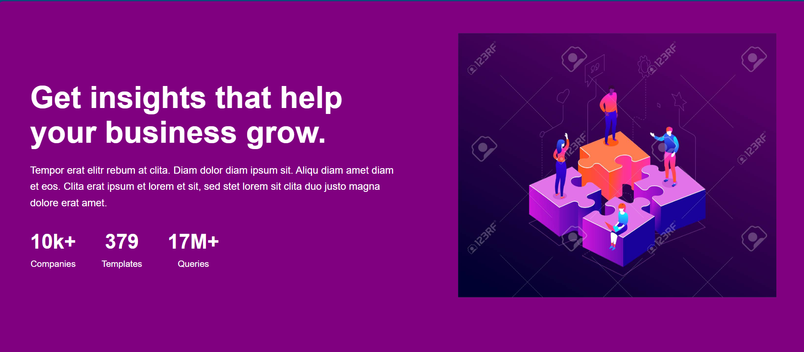

# 📊 Business Insights UI

A clean, responsive landing page section built with HTML and CSS. Highlights key business stats alongside a modern graphic.

---

## 🌐 Preview



---

## ✨ Features

- Responsive layout using Flexbox & Media Queries
- Modern color palette (Purple theme)
- Business stats section (Companies, Templates, Queries)
- Lightweight HTML & CSS, no frameworks used

---

## 📁 Project Structure

```
business-insights/
├── index.html
├── styles.css
├── assets/
│ └── preview.png
  └── team.png
└── README.md
```

---

## 🚀 Getting Started

Open `index.html` in any browser.

---

## 🛠 Built With

- HTML5
- CSS3

---

## 📄 License

This project is licensed under the MIT License.
